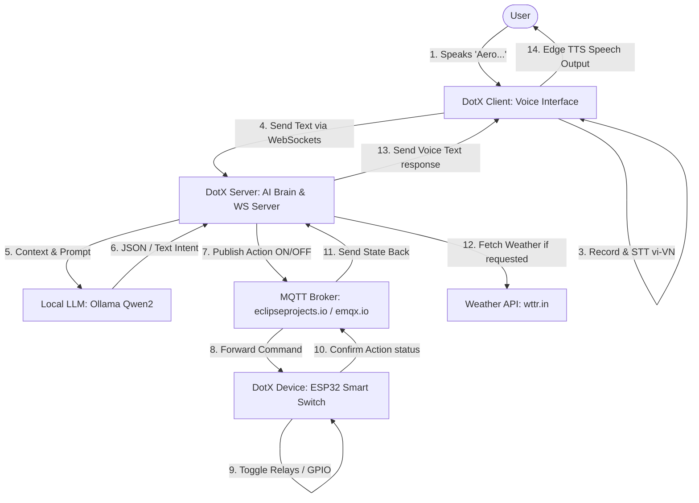

# DotX Aero: Smart Home Voice Assistant & IoT Control System

DotX Aero is a secure, end-to-end, intelligent smart home voice assistant system. It integrates modern edge voice processing, local Large Language Model (LLM) inference, and IoT hardware control via MQTT. The system is designed to run completely on consumer-grade local hardware for privacy, reliability, and low latency.

---

## 📺 Demo Video
GitHub supports direct video playback in README files. You can view the demo video below or click the link to watch it in the repository:

<div align="center">
  <video src="./demo/Aero_Finally_FF.mp4" width="100%" max-width="800px" controls></video>
  <br/>
  <a href="https://github.com/kyoo-147/DotX_Aero/blob/main/demo/Aero_Finally_FF.mp4" target="_blank">
    <strong>🎬 Watch DotX Aero Demo Video on GitHub</strong>
  </a>
</div>

---

## 🏗️ Architecture Overview

The system consists of three primary layers designed to separate concerns between voice acquisition (Client), decision making (Server), and hardware execution (IoT Device):



### 1. [DotX_Client](file:///C:/Users/navin/Downloads/DotX_Aero-20260706T045142Z-3-001/DotX_Aero/DotX_Client) (Voice Edge Interface)
Runs on an edge machine (such as a local computer, Raspberry Pi, etc.) equipped with a microphone and speakers:
*   **Wake Word Detection ([main_wakeword.py](file:///C:/Users/navin/Downloads/DotX_Aero-20260706T045142Z-3-001/DotX_Aero/DotX_Client/main_wakeword.py))**: Listens locally for the wake word **"Aero"** using the lightweight `openwakeword` framework with optimized TFLite models (`Aero.tflite`).
*   **Speech-to-Text ([main_stt.py](file:///C:/Users/navin/Downloads/DotX_Aero-20260706T045142Z-3-001/DotX_Aero/DotX_Client/main_stt.py))**: Once activated, records user commands and utilizes speech recognition (configured for Vietnamese `vi-VN`) to transcribe voice to text.
*   **WebSocket Connector ([send_text_client.py](file:///C:/Users/navin/Downloads/DotX_Aero-20260706T045142Z-3-001/DotX_Aero/DotX_Client/send_text_client.py))**: Sends transcripts to the central AI server and receives responses.
*   **Text-to-Speech ([brain_tts.py](file:///C:/Users/navin/Downloads/DotX_Aero-20260706T045142Z-3-001/DotX_Aero/DotX_Client/brain_tts.py))**: Converts the text response from the server into audio using `edge-tts` (Vietnamese voice `vi-VN-HoaiMyNeural`) and plays it back through the local speakers.

### 2. [DotX_Server](file:///C:/Users/navin/Downloads/DotX_Aero-20260706T045142Z-3-001/DotX_Aero/DotX_Server) (Local Brain & Orchestrator)
Hosts the intelligence of the system, coordinating AI reasoning and IoT outputs:
*   **WebSocket Gateway ([recv_server.py](file:///C:/Users/navin/Downloads/DotX_Aero-20260706T045142Z-3-001/DotX_Aero/DotX_Server/recv_server.py))**: A high-performance WebSocket server receiving requests and returning responses to clients.
*   **AI Brain & Smart Home Core ([brain_tts.py](file:///C:/Users/navin/Downloads/DotX_Aero-20260706T045142Z-3-001/DotX_Aero/DotX_Server/brain_tts.py))**:
    *   Integrates with **Ollama** running locally (default: `qwen2:1.5b`) to process queries.
    *   Tracks state changes for IoT switches and parses control intents (e.g., turning on/off light 1, light 2, or both).
    *   Queries weather forecasts using the **wttr.in** API and instructs the AI to generate professional weather predictions.
*   **Music Player Agent ([play_music.py](file:///C:/Users/navin/Downloads/DotX_Aero-20260706T045142Z-3-001/DotX_Aero/DotX_Server/play_music.py))**: Handles music requests using `yt-dlp` and `ffmpeg` to download and stream YouTube audio in a separate thread.
*   **TinyLLM Web Interface ([build_new.py](file:///C:/Users/navin/Downloads/DotX_Aero-20260706T045142Z-3-001/DotX_Aero/DotX_Server/build_new.py))**: Provides an alternative, ChatGPT-like Flask web UI with vector database search (Qdrant RAG) and real-time streaming response capabilities.
*   **Refactored Tests Directory ([tests/](file:///C:/Users/navin/Downloads/DotX_Aero-20260706T045142Z-3-001/DotX_Aero/DotX_Server/tests))**: Consolidates scratch scripts, test servers, and mock setups (such as mock light servers and subscriber monitors) away from production code.

### 3. [DotX_Device](file:///C:/Users/navin/Downloads/DotX_Aero-20260706T045142Z-3-001/DotX_Aero/DotX_Device) (IoT Hardware Firmware)
C/C++ firmware built using the **ESP-IDF v5.x** framework for ESP32 target microcontrollers:
*   **MQTT-over-WebSockets Client ([app_main.c](file:///C:/Users/navin/Downloads/DotX_Aero-20260706T045142Z-3-001/DotX_Aero/DotX_Device/main/app_main.c))**: Establishes a secure connection to the MQTT broker over WebSockets (`wss://`).
*   **Hardware Control Toggles**: Subscribes to command topics `/topic/qos0` through `/topic/qos3`. Toggles physical GPIO pins (GPIO 22, 23, 18, 19) connected to relay switches or LEDs representing home appliances.
*   **Feedback Mechanism**: Publishes status messages (e.g. `light1_turn_on`, `light1_turn_off`) back to MQTT topics to verify hardware state changes.

---

## 🛠️ Getting Started

### 1. Prerequisite Systems
*   **Python**: `3.9+` (Recommended)
*   **FFmpeg**: Installed and configured on the system path (required for TTS and music player translation).
*   **Ollama**: Installed and running locally. Pull the required models:
    ```bash
    ollama pull qwen2:1.5b
    ```
*   **ESP-IDF**: ESP-IDF development tools configured if compiling the firmware for the ESP32.

---

### 2. Running the Server (`DotX_Server`)

1.  Navigate to the server directory:
    ```bash
    cd DotX_Server
    ```
2.  Install dependencies:
    ```bash
    pip install websockets ollama paho-mqtt requests pytz pydub pyaudio yt-dlp flask flask-socketio beautifulsoup4 pypdf
    ```
3.  Launch the core WebSocket gateway server:
    ```bash
    python recv_server.py
    ```
    *This runs the backend WebSocket listener on `0.0.0.0:8765`, communicating with your local Ollama instance and the MQTT Broker.*

4.  *(Optional)* If you want to use the web chatbot dashboard UI, run the Flask dashboard:
    ```bash
    python build_new.py
    ```
    *Open `http://localhost:5000` to interact with the ChatGPT-style interface.*

---

### 3. Running the Edge Client (`DotX_Client`)

1.  Navigate to the client directory:
    ```bash
    cd DotX_Client
    ```
2.  Install required dependencies:
    ```bash
    pip install openwakeword speechrecognition edge-tts pydub pyaudio websockets numpy
    ```
3.  Configure Server IP:
    Open [send_text_client.py](file:///C:/Users/navin/Downloads/DotX_Aero-20260706T045142Z-3-001/DotX_Aero/DotX_Client/send_text_client.py) and change the server URI to your server's IP address:
    ```python
    uri = "ws://<YOUR_SERVER_IP>:8765"
    ```
4.  Run the voice agent:
    ```bash
    python main_client.py
    ```
5.  **Speak "Aero"** to activate the assistant. When you hear a beep sound, speak your command in Vietnamese (e.g. *"Bật đèn một"*, *"Thời tiết hôm nay thế nào?"*, *"Tắt hết đèn đi"*).

---

### 4. Flashing the ESP32 Device (`DotX_Device`)

1.  Set up the target microcontroller (e.g. ESP32, ESP32-S3):
    ```bash
    cd DotX_Device
    idf.py set-target esp32
    ```
2.  Configure Wi-Fi credentials and Broker URI:
    ```bash
    idf.py menuconfig
    ```
    *Navigate to `Example Connection Configuration` to input Wi-Fi SSID and password.*
    *Ensure the Broker URI points to the same MQTT host defined in the Server backend (such as `mqtt.eclipseprojects.io`).*
3.  Build and flash:
    ```bash
    idf.py build flash monitor
    ```

---

## 🧹 Code Cleanliness & Structural Improvements

To meet high-quality software architecture practices, the project folder has been organized:
*   **Separation of Concerns**: Kept voice acquisition modules exclusively within `DotX_Client` and server-side processing workflows within `DotX_Server`.
*   **Redundancy Reduction**: Removed duplicate and scratch files from the core directory structure.
*   **Tests Consolidation**: Grouped 13 test files and CLI test interfaces into [tests/](file:///C:/Users/navin/Downloads/DotX_Aero-20260706T045142Z-3-001/DotX_Aero/DotX_Server/tests) to prevent cluttered production deployment artifacts.
*   **Robust Network Binding**: Updated the WebSocket listener in `recv_server.py` to bind to `0.0.0.0` rather than a hardcoded local IP address.
