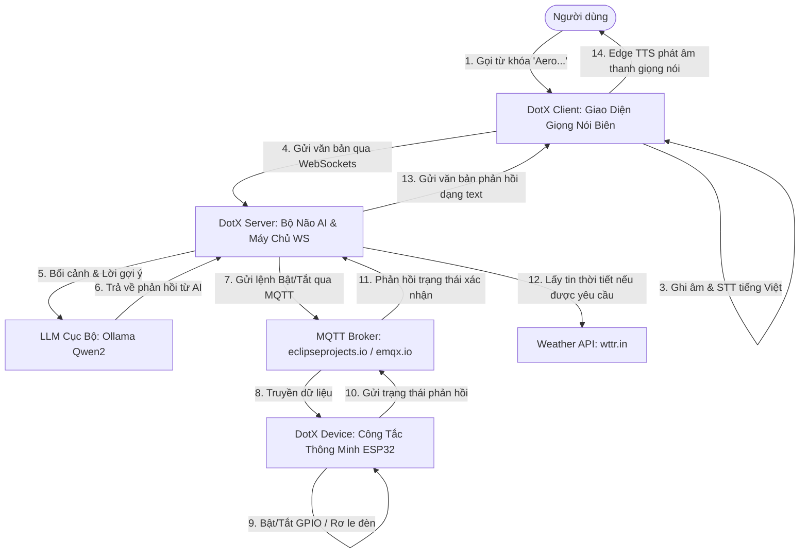

# DotX Aero: Hệ Thống Trợ Lý Giọng Nói Thông Minh & Điều Khiển Thiết Bị IoT

> [!WARNING]
> **Thông báo Lưu trữ (Archival Notice)**: Dự án này đã được triển khai 2 năm trước và hiện đã dừng hoạt động. Mọi nỗ lực hiện tại của tôi chỉ nhằm mục đích lưu trữ, mọi công nghệ có thể đã lỗi thời, chỉ nên dùng làm nguồn tham khảo.

DotX Aero là một giải pháp bảo mật toàn diện, tích hợp điều khiển nhà thông minh bằng giọng nói. Hệ thống kết hợp khả năng xử lý âm thanh ở biên (Edge), suy luận mô hình ngôn ngữ lớn (LLM) cục bộ và điều khiển phần cứng IoT thông qua giao thức MQTT. Dự án được thiết kế để chạy hoàn toàn trên phần cứng tiêu dùng cục bộ nhằm đảm bảo quyền riêng tư dữ liệu, độ ổn định cao và độ trễ tối thiểu.

---

## 📺 Video Demo
GitHub hỗ trợ phát video trực tiếp trong các tệp README. Bạn có thể xem video chạy thử (demo) bên dưới hoặc nhấn vào liên kết bên dưới để xem trực tiếp trên repository:

https://github.com/user-attachments/assets/63424c11-2eb4-4345-a65c-9f951d6440b0

<div align="center">
  <video src="./demo/Aero_Finally_FF.mp4" width="100%" max-width="800px" controls></video>
  <br/>
  <a href="https://github.com/kyoo-147/DotX_Aero/blob/main/demo/Aero_Finally_FF.mp4" target="_blank">
    <strong>🎬 Xem Video Demo DotX Aero trên GitHub</strong>
  </a>
</div>

---

## 🏗️ Tổng Quan Kiến Trúc Hệ Thống

Hệ thống bao gồm ba lớp chính nhằm tách biệt rõ ràng các nhiệm vụ thu nhận giọng nói (Client), xử lý tư duy trung tâm (Server) và thực thi lệnh phần cứng (IoT Device):



### 1. [DotX_Client](file:///C:/Users/navin/Downloads/DotX_Aero-20260706T045142Z-3-001/DotX_Aero/DotX_Client) (Giao Diện Giọng Nói Biên)
Chạy trên thiết bị biên (ví dụ: máy tính cá nhân, Raspberry Pi...) có trang bị microphone và loa phát âm thanh:
*   **Phát hiện từ khóa kích hoạt (Wake Word) ([main_wakeword.py](file:///C:/Users/navin/Downloads/DotX_Aero-20260706T045142Z-3-001/DotX_Aero/DotX_Client/main_wakeword.py))**: Lắng nghe âm thanh cục bộ để phát hiện từ khóa **"Aero"** sử dụng thư viện `openwakeword` kết hợp mô hình TFLite siêu nhẹ (`Aero.tflite`).
*   **Chuyển đổi giọng nói thành văn bản (Speech-to-Text) ([main_stt.py](file:///C:/Users/navin/Downloads/DotX_Aero-20260706T045142Z-3-001/DotX_Aero/DotX_Client/main_stt.py))**: Sau khi trợ lý được kích hoạt, ghi âm câu lệnh và dùng Google Speech Recognition (cấu hình tiếng Việt `vi-VN`) để nhận diện sang văn bản.
*   **Kết nối WebSocket ([send_text_client.py](file:///C:/Users/navin/Downloads/DotX_Aero-20260706T045142Z-3-001/DotX_Aero/DotX_Client/send_text_client.py))**: Gửi văn bản câu lệnh đến máy chủ AI trung tâm và nhận văn bản phản hồi.
*   **Chuyển đổi văn bản thành giọng nói (Text-to-Speech) ([brain_tts.py](file:///C:/Users/navin/Downloads/DotX_Aero-20260706T045142Z-3-001/DotX_Aero/DotX_Client/brain_tts.py))**: Đọc câu trả lời từ máy chủ bằng `edge-tts` với giọng nói tiếng Việt tự nhiên (`vi-VN-HoaiMyNeural`) và phát qua loa ngoài.

### 2. [DotX_Server](file:///C:/Users/navin/Downloads/DotX_Aero-20260706T045142Z-3-001/DotX_Aero/DotX_Server) (Bộ Não AI Trung Tâm)
Nơi tiếp nhận thông tin, xử lý tư duy logic AI và gửi lệnh điều khiển IoT:
*   **Cổng kết nối WebSocket ([recv_server.py](file:///C:/Users/navin/Downloads/DotX_Aero-20260706T045142Z-3-001/DotX_Aero/DotX_Server/recv_server.py))**: Nhận câu lệnh văn bản từ Client biên thông qua kết nối WebSocket thời gian thực và trả về kết quả tương ứng.
*   **Bộ não AI & Lõi điều khiển nhà thông minh ([brain_tts.py](file:///C:/Users/navin/Downloads/DotX_Aero-20260706T045142Z-3-001/DotX_Aero/DotX_Server/brain_tts.py))**:
    *   Kết nối với **Ollama** đang chạy cục bộ (mặc định sử dụng model `qwen2:1.5b`) để trả lời thắc mắc.
    *   Quản lý trạng thái các công tắc IoT ảo, phân tích ngữ cảnh người dùng để gửi tín hiệu Bật/Tắt đèn qua MQTT.
    *   Tích hợp tác vụ tra cứu thời tiết thông qua API **wttr.in** để AI tổng hợp thông tin dự báo thời tiết trực quan.
*   **Tác vụ phát nhạc YouTube ([play_music.py](file:///C:/Users/navin/Downloads/DotX_Aero-20260706T045142Z-3-001/DotX_Aero/DotX_Server/play_music.py))**: Nhận lệnh phát nhạc, tự động tải xuống âm thanh từ YouTube bằng `yt-dlp` và stream nhạc dưới dạng một luồng tiến trình (thread) chạy nền.
*   **Giao diện Chatbot Web TinyLLM ([build_new.py](file:///C:/Users/navin/Downloads/DotX_Aero-20260706T045142Z-3-001/DotX_Aero/DotX_Server/build_new.py))**: Hỗ trợ giao diện web tương tác tương tự ChatGPT, hỗ trợ RAG (cơ sở dữ liệu vectơ Qdrant) và truyền kết quả dạng stream.
*   **Thư mục lưu trữ kiểm thử ([tests/](file:///C:/Users/navin/Downloads/DotX_Aero-20260706T045142Z-3-001/DotX_Aero/DotX_Server/tests))**: Nơi tập hợp các script phát triển nháp, server mock-up kiểm tra đèn và bộ giám sát thiết bị nhằm giữ cho các file chạy chính của server luôn gọn gàng và khoa học.

### 3. [DotX_Device](file:///C:/Users/navin/Downloads/DotX_Aero-20260706T045142Z-3-001/DotX_Aero/DotX_Device) (Firmware Thiết Bị IoT)
Mã nguồn C/C++ xây dựng trên nền tảng **ESP-IDF v5.x** dành cho mạch vi điều khiển ESP32:
*   **MQTT-over-WebSockets Client ([app_main.c](file:///C:/Users/navin/Downloads/DotX_Aero-20260706T045142Z-3-001/DotX_Aero/DotX_Device/main/app_main.c))**: Thiết lập kết nối bảo mật Websocket (`wss://`) tới MQTT Broker.
*   **Điều khiển chân GPIO**: Đăng ký (subscribe) lắng nghe các topic từ `/topic/qos0` đến `/topic/qos3`. Bật/Tắt các chân GPIO vật lý (GPIO 22, 23, 18, 19) để đóng ngắt rơ le công tắc đèn.
*   **Phản hồi trạng thái**: Đăng tải (publish) các chuỗi phản hồi (như `light1_turn_on`, `light1_turn_off`) ngược lại MQTT Broker để Server cập nhật trạng thái thiết bị thực tế một cách chuẩn xác.

---

## 🛠️ Hướng Dẫn Cài Đặt & Khởi Chạy

### 1. Yêu Cầu Hệ Thống & Cài Đặt Ban Đầu
*   **Python**: Phiên bản `3.9+` (Khuyến khích).
*   **FFmpeg**: Cần được cài đặt và thêm vào biến môi trường PATH để xử lý phát nhạc và TTS.
*   **Ollama**: Tải và chạy Ollama trên máy tính của bạn, thực hiện tải mô hình AI:
    ```bash
    ollama pull qwen2:1.5b
    ```
*   **ESP-IDF**: Cài đặt bộ công cụ phát triển ESP-IDF nếu bạn cần biên dịch mã nguồn cho ESP32.

---

### 2. Chạy Máy Chủ Trung Tâm (`DotX_Server`)

1.  Di chuyển vào thư mục server:
    ```bash
    cd DotX_Server
    ```
2.  Cài đặt các gói thư viện Python cần thiết:
    ```bash
    pip install websockets ollama paho-mqtt requests pytz pydub pyaudio yt-dlp flask flask-socketio beautifulsoup4 pypdf
    ```
3.  Chạy máy chủ cổng WebSocket:
    ```bash
    python recv_server.py
    ```
    *Hệ thống sẽ chạy WebSocket server trên cổng `0.0.0.0:8765`, sẵn sàng kết nối tới Ollama cục bộ và MQTT Broker.*

4.  *(Tùy chọn)* Nếu muốn sử dụng giao diện nhắn tin Chatbot trên web, chạy Flask server:
    ```bash
    python build_new.py
    ```
    *Mở trình duyệt truy cập địa chỉ `http://localhost:5000` để trò chuyện trực quan.*

---

### 3. Khởi Chạy Trình Điều Khiển Khách Biên (`DotX_Client`)

1.  Di chuyển vào thư mục client:
    ```bash
    cd DotX_Client
    ```
2.  Cài đặt các thư viện cần thiết:
    ```bash
    pip install openwakeword speechrecognition edge-tts pydub pyaudio websockets numpy
    ```
3.  Cấu hình Địa chỉ IP của Server:
    Mở file [send_text_client.py](file:///C:/Users/navin/Downloads/DotX_Aero-20260706T045142Z-3-001/DotX_Aero/DotX_Client/send_text_client.py) và điều chỉnh địa chỉ IP máy chủ của bạn:
    ```python
    uri = "ws://<IP_MÁY_CHỦ_CỦA_BẠN>:8765"
    ```
4.  Khởi chạy Client biên:
    ```bash
    python main_client.py
    ```
5.  **Nói "Aero"** hướng về phía microphone. Khi nghe thấy một tiếng bíp ngắn phát ra, hãy nói câu lệnh của bạn bằng tiếng Việt (ví dụ: *"Bật đèn một"*, *"Thời tiết hôm nay thế nào?"*, *"Tắt hết đèn đi"*).

---

### 4. Nạp Chương Trình Cho ESP32 Device (`DotX_Device`)

1.  Cài đặt dòng mạch đích (ví dụ ESP32, ESP32-S3):
    ```bash
    cd DotX_Device
    idf.py set-target esp32
    ```
2.  Cấu hình tài khoản Wi-Fi và địa chỉ Broker MQTT:
    ```bash
    idf.py menuconfig
    ```
    *Truy cập `Example Connection Configuration` để nhập tên Wi-Fi (SSID) và mật khẩu.*
    *Đảm bảo Broker URI được thiết lập trùng khớp với MQTT Broker đang cấu hình trên Server (ví dụ: `mqtt.eclipseprojects.io`).*
3.  Biên dịch, nạp chương trình và theo dõi log:
    ```bash
    idf.py build flash monitor
    ```

---

## 🧹 Cải Tiến Cấu Trúc Mã Nguồn

Để đáp ứng tiêu chuẩn kiến trúc phần mềm chuyên nghiệp, cấu trúc dự án đã được sắp xếp lại:
*   **Phân chia rõ ràng trách nhiệm (Separation of Concerns)**: Module nhận diện giọng nói được cô lập tại `DotX_Client`, tác vụ tính toán thông minh đặt tại `DotX_Server`.
*   **Loại bỏ các file thừa**: Xóa các file nháp, các đoạn code trùng lặp không sử dụng ở thư mục chính.
*   **Gom nhóm kiểm thử**: Chuyển 13 file chạy nháp, test cục bộ và test API cũ vào thư mục riêng [tests/](file:///C:/Users/navin/Downloads/DotX_Aero-20260706T045142Z-3-001/DotX_Aero/DotX_Server/tests) để việc đóng gói triển khai máy chủ không bị rườm rà.
*   **Tối ưu hóa lắng nghe cổng mạng**: Sửa đổi WebSocket Server trong `recv_server.py` để bind vào địa chỉ `0.0.0.0` (thay vì cố định IP nội bộ cũ), tăng tính linh hoạt khi cài đặt mạng.
